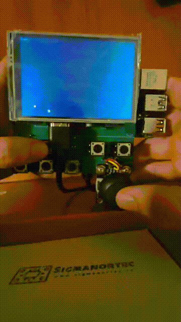
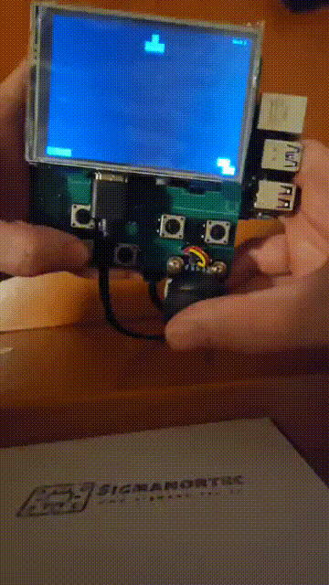
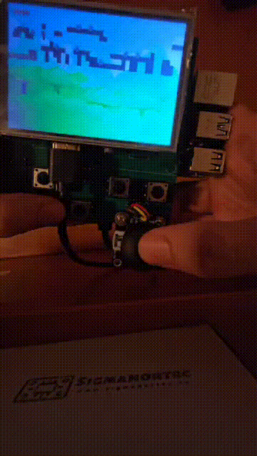
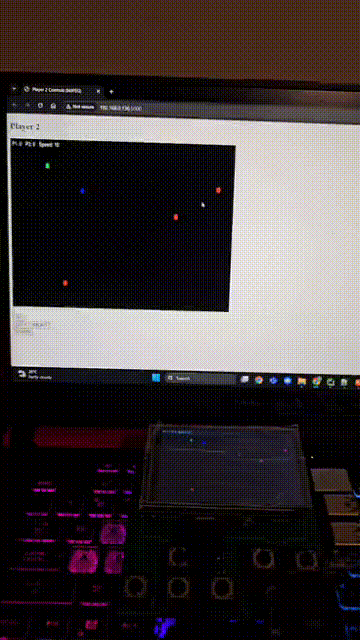

# Portable Raspberry Pi Gaming Console

A portable gaming console built using **Raspberry Pi**, **Python**, **Pygame**, GPIO buttons, and an analog joystick.

This project implements a complete handheld gaming system with a graphical menu and multiple playable games, including **Snake**, **Tetris**, **a Platformer**, and a **Slither-style multiplayer prototype**.

---

## Project Overview

This project explores the design and implementation of a **portable embedded gaming system** using low-cost hardware and custom software.

The console integrates:

- Raspberry Pi 4
- HDMI display
- GPIO buttons
- Analog joystick input
- Python / Pygame game engine
- Custom graphical game launcher

The system boots into a fullscreen graphical menu where the user can navigate between games and launch them directly from the console interface.

The goal of the project is to combine **embedded hardware development**, **game programming**, and **system architecture design** into a single portable device.

---

## System Architecture

The system consists of the following major components:

| Component | Role |
|----------|------|
| Raspberry Pi 4 | Main computing unit |
| HDMI Display | Game output |
| GPIO Buttons | Player input |
| Analog Joystick | Directional control |
| ADC Converter | Reads analog joystick signals |
| Power System | Portable power supply |

The Raspberry Pi runs the Python-based game framework, handles GPIO input, processes joystick signals, renders graphics, and switches between the different games.

---

## Software Architecture

The software is organized into several modules:

| Module | Description |
|--------|-------------|
| `main.py` | Main console launcher and game menu |
| `main_platformer.py` | Platformer entry point |
| `utils.py` | GPIO and joystick input handling |
| `settings.py` | Game constants and world configuration |
| `world.py` | Platformer world generation and collision logic |
| `player.py` | Player behavior and animation |
| `tile.py` | Terrain tiles |
| `trap.py` | Trap mechanics |
| `goal.py` | Goal object logic |
| `slither.py` | Slither-style game prototype |
| `support.py` | Asset loading utilities |

The main launcher initializes the display, reads the controls, shows the menu, and starts the selected game.

---

## Games Implemented

### Snake

Classic Snake implementation featuring:

- food spawning
- score tracking
- increasing speed
- joystick and button controls

### Tetris

Tetris implementation including:

- tetromino rotation
- line clearing
- score system
- responsive controls

### Platformer

The platformer game includes:

- tile-based world
- traps and hazards
- gravity and collisions
- player animations
- scrolling gameplay
- goal-based level completion

### Slither Prototype

A Slither-style multiplayer game prototype integrated into the console menu.

---

## Controls

### GPIO Button Mapping

| Function | GPIO Pin |
|----------|----------|
| Up | GPIO 26 |
| Down | GPIO 19 |
| Left | GPIO 13 |
| Right | GPIO 6 |
| Select | GPIO 5 |
| Reset | GPIO 21 |

### ADC Pins

| Signal | GPIO |
|--------|------|
| CLK | 23 |
| DO | 16 |
| DI | 20 |
| CS | 24 |

The joystick input is read through an ADC converter, allowing analog directional control.

---

## Repository Structure

```text
Portable_Raspberry_Pi_Gaming_Console/
├── README.md
├── requirements.txt
├── docs/
│   └── screenshots/
│       ├── menu.png
│       ├── snake.png
│       ├── tetris.png
│       └── platformer.png
│   └── demo/
        ├──demo_video.mp4
├── hardware/
│   
├── src/
|   |── assets/
|   |── static/
│   ├── main.py
│   ├── main_platformer.py
│   ├── settings.py
│   ├── utils.py
│   ├── world.py
│   ├── player.py
│   ├── goal.py
│   ├── trap.py
│   ├── tile.py
│   ├── slither.py
│   └── support.py

```

---

## Installation

Clone the repository:

```bash
git clone https://github.com/vladciolacu17/Portable_Raspberry_Pi_Gaming_Console.git
cd Portable_Raspberry_Pi_Gaming_Console
```

Install dependencies:

```bash
pip install -r requirements.txt
```


## Running the Project

Run the main console launcher:

```bash
python3 src/main.py
```


## Screenshots

### Snake



### Tetris



### Platformer



### Slither



---

## Demo

Watch the console running:

[Demo Video](docs/demo/DEMO.mp4)

---

## Future Improvements

Possible future improvements include:

- improved joystick calibration
- battery monitoring
- audio support
- additional games
- performance optimization for small displays

---
------------------------------------------------------------
Author
------------------------------------------------------------

Vlad-Stefan Ciolacu<br>
GitHub: https://github.com/vladciolacu17

------------------------------------------------------------
License
------------------------------------------------------------

MIT License
